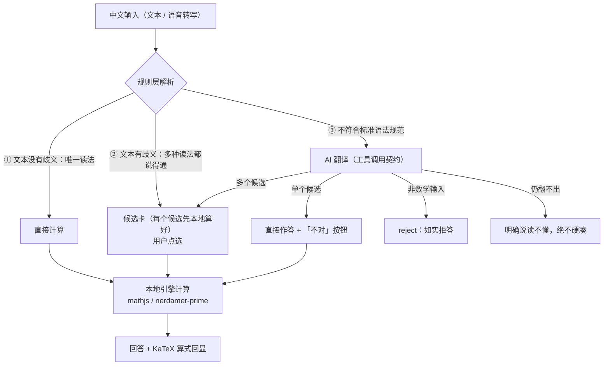
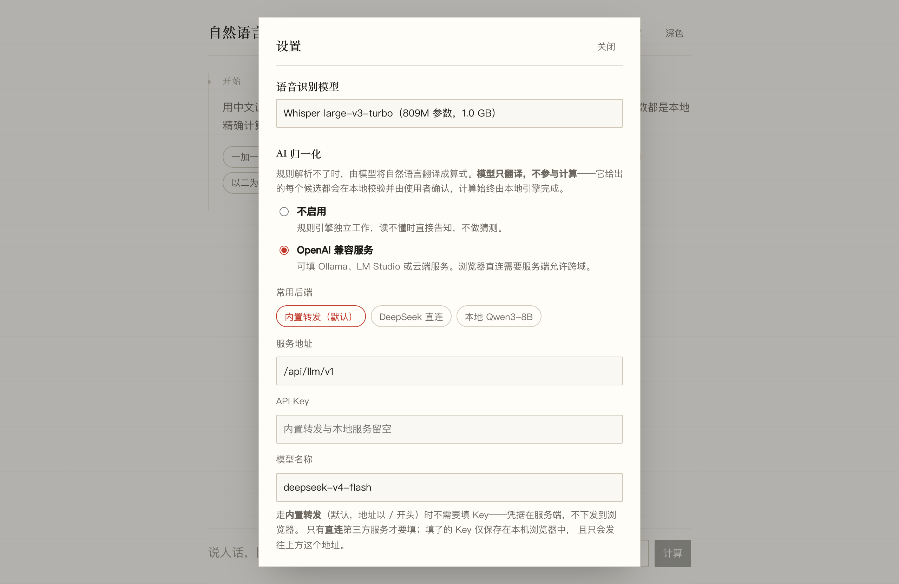

<div align="center">

# 自然语言计算器

**说人话，算精确** —— 中文口语进，精确数学出


</div>

## 目录

| | | |
|---|---|---|
| [一、这是什么](#一这是什么) | [二、架构：一次提问的三种结局](#二架构一次提问的三种结局) | [三、规则解析](#三规则解析中文怎么变成规范表达式) |
| [四、AI 解析](#四ai-解析两种后端两种拴法) | [五、什么算歧义](#五什么算歧义) | [六、计算](#六计算mathjs-与-nerdamer-prime) |
| [七、测试与可交付性](#七测试与可交付性) | [八、安装与运行](#八安装与运行) | [九、致谢与许可](#九致谢与许可) |

> GitHub 页面右上角的 <kbd>≡ Outline</kbd> 按钮有全文侧边目录。

---

## 一、这是什么

**把中文口语翻译成计算引擎能理解的规范表达式，然后让引擎去算。** 数学算法一个都不是我们写的——加减乘除、三角、高精度、复数、解方程、求导积分，全部来自 [mathjs](https://github.com/josdejong/mathjs) 与 [nerdamer-prime](https://github.com/together-science/nerdamer-prime)；我们写的是**翻译**（规则构式层 + LLM 归一化）和**把翻译拴住的一整套约束**。

| 规则解析 · 连续追问 | 歧义 · 候选卡点选 | AI 翻译 · 本地计算 |
|---|---|---|
|  |  |  |
| `一加一等于几` → 等于二<br/>`那再乘以五呢` → 等于十<br/>`根号二` → **约**等于 1.414… | `六除二` 有两种读法，<br/>每个候选都先本地算好，<br/>看着答案选 | 应用题由 AI 翻成 `3*5.2`，<br/>**算出 78/5 的是本地引擎**，<br/>角标注明来源，可一键反悔 |

核心主张一句话：**理解可以有歧义，计算不可以。** 模型再不靠谱，最坏结果也只是让你多点一次「不对」，而不会得到一个错的数。

---

## 二、架构：一次提问的三种结局

一句话进来，先由规则层尝试解析，结局只有三种——**这三个判断是整个系统的骨架**：



| 结局 | 触发条件 | 界面行为 |
|---|---|---|
| **① 无歧义** | 规则层解析出唯一一种规范表达式 | 直接给答案，角标「规则」 |
| **② 有歧义** | 同一句话能读成多个都说得通的算式 | 候选卡：每个候选连同**本地算好的结果**一起列出，点哪个用哪个；「都不是」转交 AI 重译 |
| **③ 不符合标准语法规范** | 规则文法覆盖不了这句话 | 交给 AI 翻译成工具调用；单候选直接作答（带「不对」按钮），多候选出卡，非数学输入如实拒答 |

三种结局殊途同归：**算数永远发生在本地引擎**。AI 从不参与计算，它最多提议"这句话可能是这个算式"，且提议必须过白名单校验、本地试算成功才有资格出现在界面上。

支持跨轮追问与多步提问（是步骤，不是二选一）：

```
你：1+1等于几                    → 等于二           1+1 = 2
你：那在这个基础上再乘以5          → 等于十           (1+1)·5 = 10
你：1+2×3等于几？再乘5？再加3？    → 7 → 35 → 38     三步逐条作答
```

---

## 三、规则解析：中文怎么变成规范表达式

**输入**是一句中文（允许中阿混写、语音转写的不规整文本），**输出**是一个「规范表达式」——

> **规范表达式 = mathjs 语法的白名单子集**：显式乘号、完整括号、只允许固定的函数与常量（`sqrt/log/sin/…/pi/e/i`），禁用赋值、索引、数组、`%`。它同时是三样东西：规则层的输出目标、AI 翻译的输出契约、给用户回显的算式。

解析分五步，前四步是数据驱动，第五步是手写文法：

| 步骤 | 做什么 | 例 |
|---|---|---|
| 1 归一化 | 全半角统一、剥离填充词与问句尾 | 「等于几呢？」剥掉 |
| 2 分词 | 词表最长匹配（`除以`>`除`）+ 中文数字识别（cn2an 规则移植） | 「一万二」→ 12000，「一二三」→ 123（数码串） |
| 3 意图分流 | 求值 / 解方程 / 求导积分 | 「解方程…的解」「…求导」 |
| 4 扁平模板 | 先消掉**不连续三段式构式** | 「以2为底8的对数」→ `log(8,2)` |
| 5 递归下降 | 优先级、就近绑定、「的」后缀、括号化 | 「三与五的和乘以二」→ `(3+5)*2` |

**可直接解析的范围**（每类都有钉住的测试用例）：

| 类别 | 说法举例 | 翻译到 |
|---|---|---|
| 四则 | 加/加上、减去、乘以、除以、裸「除」 | `+ - * /`（裸「除」→ 歧义候选） |
| 数字 | 中文/阿拉伯/混写、口语（一万二、两百五、3千2） | 精确数值，非法组合抛错不猜 |
| 幂与根 | X的Y次方/平方/立方、根号X、X开N次方 | `(X)^(Y)`、`sqrt`、`nthRoot` |
| 对数 | ln/lg/log、以B为底X的对数 | `log(X)`、`log10(X)`、`log(X,B)` |
| 三角/双曲 | sin/正弦/反正弦/双曲正弦…、X度 | 带「度」自动 `(X*pi/180)` |
| 百分比/分数 | 百分之二十、三分之一、打八折、涨一成 | 翻译层展开成 `(20/100)`、`*0.8`… |
| 名词形 | A与B的和/差/积/商 | `(A op B)` 自带括号 |
| 其他 | 阶乘、绝对值、余数/取模、倒数、复数 i | `factorial/abs/mod/(1/X)/i` |
| 方程/微积分 | 解方程…、求导、积分 | 路由到求解引擎 |
| 追问 | 再乘以五、然后加三 | 接上一轮结果（仅当上一轮是单个数值） |

三个决定文法形状的用例，面试常问，值得单独记：

1. **负号绑定**：`负二的平方` = (-2)² = 4，`负的二的平方` = -(2²) = -4——隔着「的」决定「负」归词法还是归运算符；
2. **链式幂全括号**：中文「二的三次方的二次方」从左往右是 (2³)²=64，mathjs 的 `^` 右结合会读成 2^(3²)=512，所以规范表达式一律全括号，**让引擎无法重新理解**；
3. **三段式构式**：「以二为底八的对数」的「的」管的是整个前段，递归下降的后缀前瞻看不到这种跨度，所以在文法之前加扁平模板 pass。

词表（`src/core/grammar/lexicon.json`）是数据，加一种说法通常一行；文法（`parser.ts`）是手写递归下降，因为优先级、就近绑定、递归是模板表达不了的。

---

## 四、AI 解析：两种后端，两种拴法

规则层覆盖不了的句子（口语绕弯、应用题、语音同音字）交给 LLM。**模型的唯一职责是翻译成一次工具调用**——五个工具：`evaluate / solve / diff / integrate / reject`，参数里强制带 `reading`（中文复述，候选卡上给人看的）。

```jsonc
// 请求（OpenAI 兼容 /chat/completions）
{ "model": "deepseek-v4-flash", "temperature": 0,
  "messages": [{ "role": "system", "content": "你是中文数学问题的翻译器…" },
               { "role": "user",   "content": "根号酒等于几" }],
  "tools": [ /* 5 个工具，全部 strict:true */ ],
  "tool_choice": "auto" }

// 响应：不是自由文本，是结构化调用
{ "tool_calls": [{ "function": { "name": "evaluate",
    "arguments": "{\"expression\": \"sqrt(9)\", \"reading\": \"根号九等于几\"}" } }] }
```

### DeepSeek（默认）：prompt 工程 + strict 信封

- **系统提示词四要素**：角色钉死为"翻译器"；**语音同音字纠错表**（「根号酒」是「根号九」、「成」极可能是「乘」）；**歧义纪律**（通常只调一次工具，真歧义才调两次，"凑数的理解比没有理解更糟"）；**reject 指引**（不是数学问题就走拒绝出口，不要硬凑）。
- **表达式文法写在 schema 的参数描述里**而不是提示词正文——函数白名单、显式乘号、`log 是自然对数`、`ln/lg 也接受`。schema 是模型在 function calling 下权重最高的上下文。
- **strict:true**：服务端把 JSON Schema 编译成 token 级自动机，模型物理上吐不出坏结构（这是"信封"级硬约束；表达式字符串内部靠白名单事后闸门）。
- `temperature: 0`，同样输入同样翻译；`tool_choice: "auto"`——`required` 会被 DeepSeek 思考模型直接 400，而且有了 reject 工具，"必须调用"本来就自相矛盾。
- **降级阶梯**：原生 FC → 4xx/空 → 文本 JSON 契约，两条路收敛到同一个 ToolCall 结构；参数解析带修复（裸控制字符、`"42"`→`42`、`x²+1=0` 自动移项、`x=2=2` 多等号拒绝）。

### Qwen3-8B（本地）：harness 工程——文法级约束

本地跑 Ollama 时走同一套契约；进一步的**采样层约束**已在 llama.cpp 上实测跑通（[experiments/constrained-decoding/](experiments/constrained-decoding/)）：把规范表达式写成 **10 行 GBNF 文法**挂进采样器，出格 token 的概率直接置零。

| qwen3:8b 实测（8 用例） | 形式合规 | 语义正确 | 单条延迟 |
|---|---|---|---|
| 无约束 | 6/8（写了非法 `ln`） | 5/8 | 187–577ms |
| + GBNF 文法 | **8/8** | 7/8 | 116–307ms（掩码剪枝反而更快） |
| + 文法 + 思考区 | **8/8** | **8/8** | 稍长 |

实验撞出的三条定律（详见实验 README）：**硬约束必须内置诚实出口**（纯表达式文法会把"今天天气不错"逼成 `sqrt(-1)`，加 `| "reject"` 产生式才对）；**形式约束可能挤压出语义错误**（模型想写 `ln` 被堵死会丢掉对数——所以主干把 ln/lg 纳入表面语言、在边界归一）；**给约束开思考区可救回语义**。

### 共同下游：四道闸，模型永不算数

无论哪个后端，模型给的每个候选都要连过：**白名单 AST 校验**（越权符号整棵拒绝）→ **计算预算**（节点数、阶乘参数、指数上限）→ **本地真跑一遍**（跑不通不上屏）→ **人确认**（复述 + 同源公式回显 + 「不对」按钮）。语音同音字的完整链路是最好的注解：

```
语音「根号九是多少」→ Whisper 听成「根号酒」→ 规则读不懂 → AI 提议 sqrt(9)（复述：酒→九）
→ 本地引擎算出 3        ← 算出 3 的是引擎，模型全程只提议了一个读法
```

---

## 五、什么算歧义

**定义**：同一句话存在两种以上都说得通的读法，且它们产出**不同的规范表达式**。

| 判定来源 | 机制 | 例 |
|---|---|---|
| 规则层 | 多个构式同时命中，解析出多个不同表达式 | 「六除二」→ `6/2` 与 `2/6`（中文的"除"两个方向都合法） |
| AI 层 | 模型返回多个工具调用（提示词要求：真歧义才给第二种） | 「派乘以二的平方」→ `pi*2^2` 或 `(pi*2)^2` |
| 合流去重 | 按**工具调用本身**去重（不是按展示公式——两个不同调用可能投影成同一串） | `solve(x+y,x)` 与 `solve(x+y,y)` 都保留 |

处理原则：

- 每个候选**先在本地算出结果**再列出——让人看着答案选，比读语法解释可靠；
- AI 只给一个候选时**直接作答**，不摆多余的确认步骤，答案下方保留「理解得不对？换一种」；
- 「都不是」→ 原话转交 AI 换一种理解；
- **不算歧义**的两类：多步提问（「1+2×3等于几？再乘5等于几？」是**步骤**，逐条作答）；追问（「再乘以五」接上一轮，仅当上一轮结果是单个数值，否则明说"接不上"）；
- 组合会爆炸的直接拒绝：一句话里出现多个裸「除」时提示改说「除以」，不猜。

---

## 六、计算：mathjs 与 nerdamer-prime

计算层就是两个引擎，各管一段：

| 引擎 | 管什么 | 为什么是它 |
|---|---|---|
| **mathjs**（Apache-2.0） | 四则、幂根、三角/双曲、对数、阶乘、复数、大数、精确分数 | BigNumber 模式一步同时解决 `0.1+0.2=0.3` 与科学函数；AST 可白名单化；`toTex` 与计算同源 |
| **nerdamer-prime**（MIT，惰性加载 ~3MB） | 解方程、符号求导、不定积分 | JS 生态唯一同时有通用 `solve` 与符号微积分的库；选分叉因为它仍在活跃维护 |

**参考的模式。** 这个"翻译到宿主引擎"的形态不是我们发明的——调研过的同类产品全是同一个模式：SymPy Gamma 把英文放松记法翻译成 **SymPy 表达式**再交给 SymPy 算，SoulverCore 把口语翻译成**自研引擎的内部形**，NoteCalc/recomputer 把宽松语法解析成**自研 AST** 后十进制求值。共同点是：**自然语言层只做翻译，落到一个规范形式，由确定性引擎求值**。我们的规范形式选了 mathjs 语法子集，并从它们那里各借了一个思想：词表做成数据（notepad-based-calculator）、中英语法叠加（SoulverCore）、规范形与显示形分离（SymPy Gamma）。

### 表达式树：进入引擎的是什么

进入 mathjs 的不是一串等式，是**一整棵表达式树**。`(1/4)^(-1/2) * sqrt(64) / 10` 解析成：

```
OperatorNode /
 ├─ OperatorNode *
 │   ├─ OperatorNode ^   ← (1/4) 与 (-1/2)
 │   └─ FunctionNode sqrt(64)
 └─ ConstantNode 10
```

求值是对这棵树做一次**后序遍历**：叶子（常量）先算，逐层向上合并——`(1/4)^(-1/2)→2`、`sqrt(64)→8`、`2×8÷10→1.6` 都是遍历中各节点的中间值，一趟递归完成。关键设计是**同一棵树有五个消费者**：

1. **白名单校验**——函数名不在表内、符号不是 `pi/e/i`、出现赋值/索引 → 整棵拒绝（含变量的字符串到不了引擎）；
2. **计算预算**——数节点、抓 `factorial`/`^` 的参数字面量，`9^(9^9)` 在这里死，不用等它卡死页面；
3. **数字分档**——纯四则+整数幂 → **Fraction**（`三分之一的平方` = 1/9 精确）；默认 → **BigNumber 64 位**（`0.1` 按十进制字面量读入，从不路过 double）；含 `i` → **Complex**。整条表达式一档定死，绝不中途混；
4. **求值**——BigNumber 语境下递归；
5. **KaTeX 回显**——同一棵树 `toTex()`，所以**你看到的公式和实际算的是同一个数据结构的两个投影**。

### 对第三方引擎的防线

nerdamer 的输出一律当**不可信输入**对待：语法先改写（`nthRoot/cbrt/log10/log2/双参 log` 换底展开成它认识的形式）；内部异常会污染全局单例 → 毒化隔离标志；**每个根代回原方程验残差**，不合格的剔除并注明；表达不了的区间解（`|x|=x` 实为 x≥0）→ 附"结果可能不完整"的诚实注记：

<div align="center"></div>

### 几条值得一问的精度决策

- **零值吸附用收敛判据**：64→128→256 位三档复算，误差按比例持续缩小才判真噪声归零——`sin(π)×10¹⁰⁰` 得 0，而 `sin(π+10⁻¹⁰⁰)` 得 ≈-10⁻¹⁰⁰，不误伤真实小量；
- **等于 / 约等于是语义**：结果携带 exact 标志，`√2` 说"约等于"、`30!` 的 33 位整数完整显示说"等于"；50 位以上整数才转科学计数并改口"约等于"；
- **百分比在翻译层展开**：mathjs 的 `50%(13)` 是取模陷阱，引擎只见显式除法；
- **偶次根走 `sqrt`**：`sqrt(-4)` 提升成 `2i`；奇次根走 `nthRoot`，`nthRoot(-8,3) = -2` 符合直觉。

---

## 七、测试与可交付性

可交付性的主张不是一个百分比，是**错误的形态**：最坏结果是"说不会"，绝不是"给错数"。前者是拒答率问题，可以迭代；后者是可信度问题，架构上焊死。

### 我们怎么测：七层结构式覆盖

| 层 | 方法 | 来源 |
|---|---|---|
| 数字层 | cn2an 的 ~120 正例 + 20 负例原样移植，**非法输入必须抛错** | 上游资产 |
| 运算语义 | libqalculate 的对照表改造成回归基线 | 上游资产 |
| 词表覆盖 | **元测试机器强制**：每个词条必须有用例，加词不加测试直接红 | 自建 |
| 构式相邻 | 两两组合边界（「二成一三」类 bug 只活在构式接壤处） | 自建 |
| 性质测试 | 不变量扫射：任何输入 → 算对 或 明确报错，**绝不静默给错数** | 自建 |
| 回归棘轮 | 任何人发现的每个 bug 固化为永久用例（现 489 条全绿） | 持续 |
| 端到端 | 浏览器实测 + LLM 翻译战役 + 语音链路 | 实测 |

### 外部对抗审阅（Codex）怎么测

开发中把代码交给外部审阅者（OpenAI Codex）做了多轮**对抗式证伪**——它不跑覆盖率，专门构造反例，六个扫描面：数值精度边界（`sin(π)×10¹⁰⁰`）、第三方引擎信任（构造调用序列毒化 nerdamer）、契约自洽（`tool_choice` 与提示词矛盾）、并发状态（快慢请求交错覆盖上下文）、资源预算（`一亿的阶乘`）、展示语义（`√2` 配"等于"）。**它的纪律是每项发现必附可复现输入与实际输出**；共报 17 项，全部修复并复核，每个反例固化为回归用例。两套方法互补：结构覆盖防"漏做"，对抗证伪防"做错"，回归棘轮防"退化"。

### 金标准：每类问题怎么判"可运行"

| 问题类别 | 判定金标准 |
|---|---|
| 中文数字 | cn2an 全套正负例通过；非法串（「一千零十」）抛错而非猜测 |
| 构式覆盖 | 词表覆盖元测试 0 缺失 + 相邻组合全绿 |
| 运算正确性 | libqalculate 对照 + mathjs 上游 321 个测试文件背书，我们只测翻译 |
| 方程/微积分 | 每个根代回原方程，残差超限即剔除；结果可能不完整时必须注明 |
| LLM 翻译 | 22 条战役用例（基础/同音字/歧义双候选/应用题/注入拒答）全过；用例有区分度（1.5B 只过 6/14，故下架） |
| 语音 | 按"端到端算对"打分而非逐字一致（turbo 4/5，base 1/5） |
| 全局 | 性质测试：绝不给出错误答案 |

**范围的诚实表述**：对规则层的封闭文法，覆盖是**结构 100%**（词表 × 构式 × 相邻组合是有限集）；对开放的自然语言输入，不承诺"模型不会错"，承诺"模型错了也到不了错误答案"（四道闸）；对发现的每个逃逸，棘轮保证不复发。逐项能力边界见 **[BOUNDARIES.md](BOUNDARIES.md)**，完整测试策略见 **[TESTING.md](TESTING.md)**。

已知限制（挑最重要的）：方程限一元；未做求极限与微分方程；名词形分组只支持简单操作数；复数受 double 精度上限约束；小于 10⁻¹²⁸ 量级的真实值在收敛判据分辨率之外。

---

## 八、安装与运行

```bash
npm install
npm run dev        # http://localhost:5173
npx vitest run     # 489 个测试
```

克隆下来就能用，代码之外只有两样东西不在仓库里，都不挡路：

| 东西 | 处理 |
|---|---|
| 语音模型权重（~1.3GB） | **什么都不用做**：`public/models/` 有权重就全程离线，没有则首次用语音时自动从 HuggingFace 下载进浏览器缓存 |
| DeepSeek API key | 可选。想用内置转发就 `export DEEPSEEK_API_KEY=sk-xxxx`（或写进项目根 `.deepseek.key`，已在 .gitignore）；不配也行——规则引擎完整可用，或在设置里换后端 |

设置面板三个预设，点一下换 LLM 后端：

| 预设 | 地址 | 模型 | key |
|---|---|---|---|
| **内置转发**（默认） | `/api/llm/v1` | `deepseek-v4-flash` | 不用，凭据在服务端 |
| DeepSeek 直连（BYOK） | `https://api.deepseek.com/v1` | `deepseek-v4-flash` | 自备，只存本机浏览器 |
| 本地 Qwen3-8B | `http://localhost:11434/v1` | `qwen3:8b` | 不用，需 `OLLAMA_ORIGINS='*' ollama serve` |

<div align="center"></div>

语音输入完全本地（浏览器里跑 Whisper，WebGPU 加速、WASM 兜底），识别结果**填进输入框不自动发送**，让人过目再回车。档位实测（`node scripts/eval-voice.mjs base small turbo`，按端到端算对打分）：base 1/5 · small 0/5 · **turbo 4/5（默认）**。turbo 唯一的失败「根号九→根号酒」是同音字，正好由 AI 归一化接住。

LLM 翻译评测复跑：

```bash
node scripts/eval-llm.mjs                                              # DeepSeek，key 从环境读
node scripts/eval-llm.mjs --base-url http://localhost:11434/v1 --model qwen3:8b
```

---

## 九、致谢与许可

计算引擎与规则资产全部来自开源社区，**逐项引用与差异说明见 [CREDITS.md](CREDITS.md)**（mathjs、nerdamer-prime、cn2an 规则移植、nzh、libqalculate 测试资产、transformers.js/Whisper、架构思想来源），Apache-2.0 衍生声明见 [NOTICE](NOTICE)。能力边界：[BOUNDARIES.md](BOUNDARIES.md) · 测试策略：[TESTING.md](TESTING.md) · 约束解码实验：[experiments/constrained-decoding/](experiments/constrained-decoding/)
